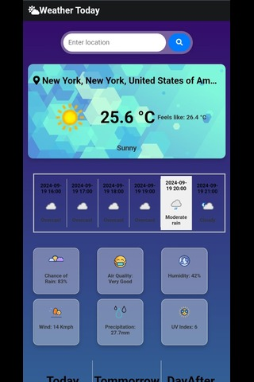

# WeatherToday

**WeatherToday** is a responsive web application that provides weather information. This project was built using HTML, CSS, and JavaScript.

Although the code reflects my early efforts as a beginner, the application showcases my foundational web development skills and responsive design principles.

## Live Demo

You can view the live version of the project here: [https://weather-today-tzxc.onrender.com](https://weather-today-tzxc.onrender.com)

## Screenshots

### Desktop View

### Mobile View

## Features

- **Responsive Design:** The application adjusts seamlessly to various screen sizes.
- **Weather Information:** Provides current weather details based on user input.
- **Simple User Interface:** Designed for easy navigation and usability.

## Technologies Used

- **HTML:** For creating the structure of the web pages.
- **CSS:** For styling and layout, ensuring a responsive design.
- **JavaScript:** For handling dynamic weather data and user interactions.

## ⭐️ If you like this project or find it useful, please consider giving it a star!
